Seminar
========================================================
author: Emilio Berti
date: 
autosize: true

The problem
========================================================


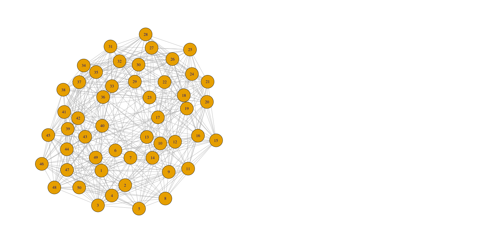

The problem
========================================================

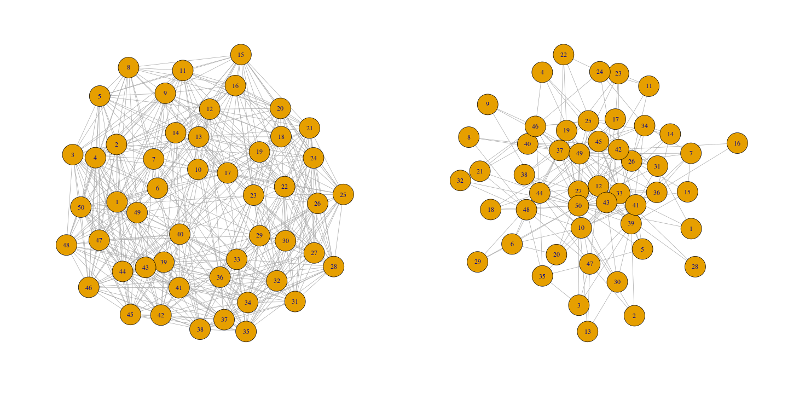

The problem
========================================================

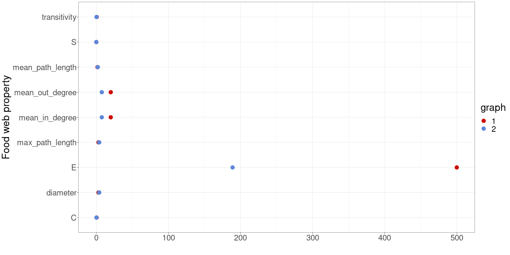

The problem
========================================================


## Why?

The problem
========================================================


**Local processes (e.g., available species pool)**

***

The problem
========================================================


**Local processes (e.g., available species pool)**

***

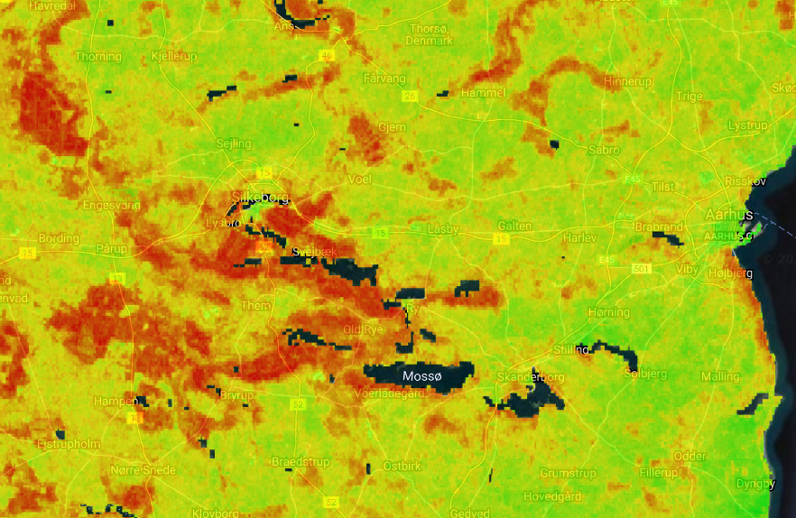

**Environmental factors (e.g., pH)**

Approach summary
========================================================

* Gateway database
* Environmental predictors from several databases
* Multivariate analysis that includes spatial structure

Gateway database
========================================================

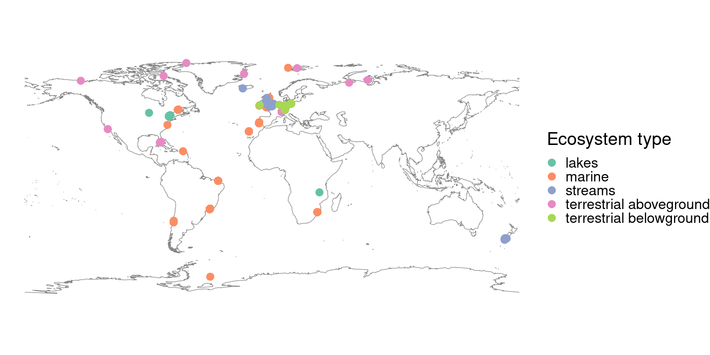

For now, focusing only on marine ecosystem.

Environmental predictors
========================================================
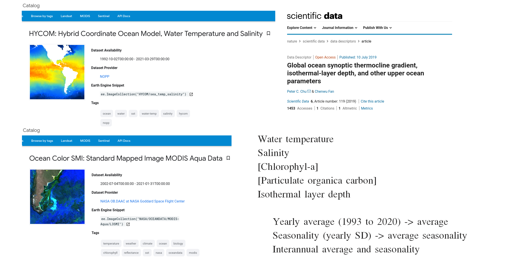

Environmental predictors
========================================================
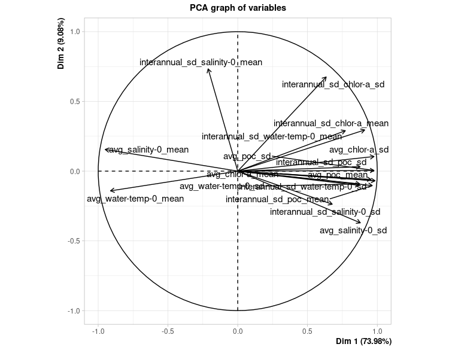

***

Environmental predictors
========================================================


***


|variable                         |   R2|      VIF|
|:--------------------------------|----:|--------:|
|avg_chlor-a_mean                 | 0.85| 6.745834|
|avg_water-temp-0_mean            | 0.83| 5.782913|
|avg_water-temp-0_sd              | 0.83| 5.725984|
|interannual_sd_water-temp-0_mean | 0.73| 3.654555|
|interannual_sd_chlor-a_sd        | 0.64| 2.781000|
|interannual_sd_salinity-0_mean   | 0.36| 1.572712|

Multivariate analysis: space
========================================================
1. Define food webs that are neighbors, i.e., connected or not (adjacency matrix).
2. Weight the links using a defined distance function (Spatial weighting matrix; SWM).

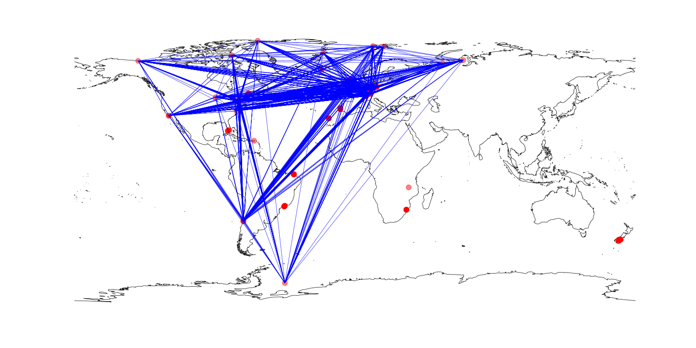

Multivariate analysis: space
========================================================
1. Define food webs that are neighbors, i.e., connected or not (adjacency matrix).
2. Weight the links using a defined distance function (Spatial weighting matrix; SWM).

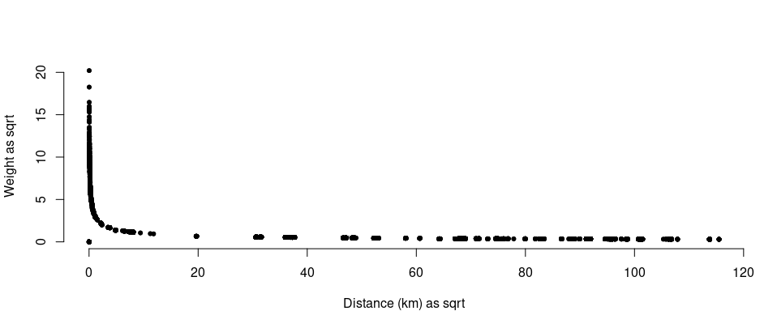

Multivariate analysis: space
========================================================
1. Define food webs that are neighbors, i.e., connected or not (adjacency matrix).
2. Weight the links using a defined distance function (Spatial weighting matrix; SWM).
3. Obtain Moran's Eigenvector Maps (MEMs): MEMs are orthogonal vectors with a unit norm that maximize Moran’s coefficient of spatial autocorrelation.

Multivariate analysis: space
========================================================
1. Define food webs that are neighbors, i.e., connected or not (adjacency matrix).
2. Weight the links using a defined distance function (Spatial weighting matrix; SWM).
3. Obtain Moran's Eigenvector Maps (MEMs): MEMs are orthogonal vectors with a unit norm that maximize Moran’s coefficient of spatial autocorrelation.
4. Select MEMs that are significant in explaining the food web properties

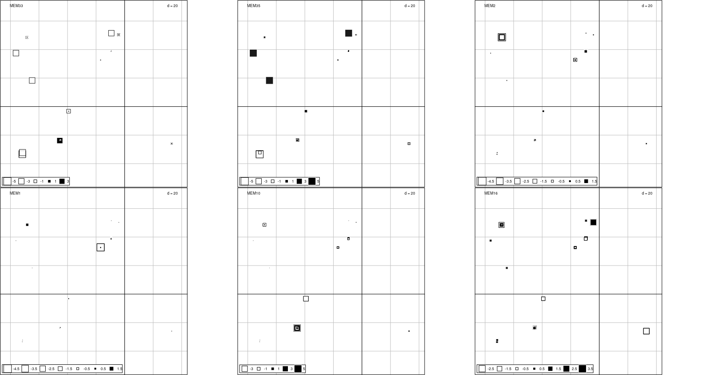

Multivariate analysis: space
========================================================
1. Define food webs that are neighbors, i.e., connected or not (adjacency matrix).
2. Weight the links using a defined distance function (Spatial weighting matrix; SWM).
3. Obtain Moran's Eigenvector Maps (MEMs): MEMs are orthogonal vectors with a unit norm that maximize Moran’s coefficient of spatial autocorrelation.
4. Select MEMs that are significant in explaining the food web properties
5. Redundancy analysis (RDA), aka the constrained PCA or the multivariate extension of multiple linear regression. 

RDA performs a PCA between a response matrix **R** and a predictor matrix **P** with principal components being linear combinations of **R** and **P**.

RDA finds those components of **R** which are linear combinations of **R** and (among those) represent as much variance of **R** as possible.

Redundancy analysis
========================================================


```r
pca <- dudi.pca(response,
                scale = TRUE,
                scannf = FALSE,
                nf = 3)
rda <- pcaiv(pca,
             predictors,
             scannf = FALSE,
             nf = 2)
```

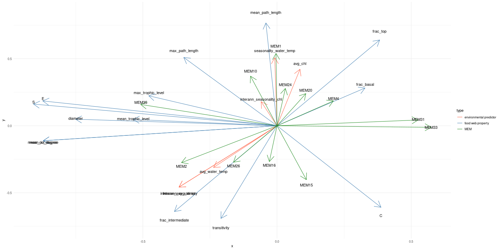

Redundancy analysis - correlation plot
========================================================


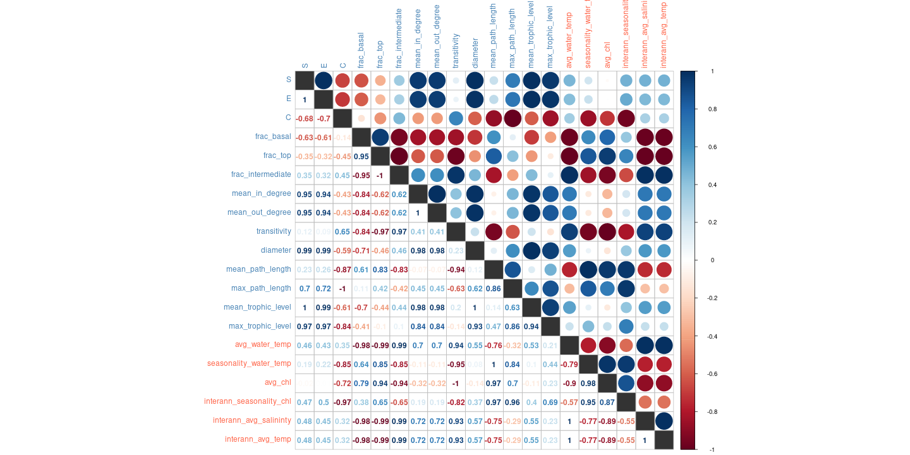

Redundancy analysis - variation partitioning
========================================================
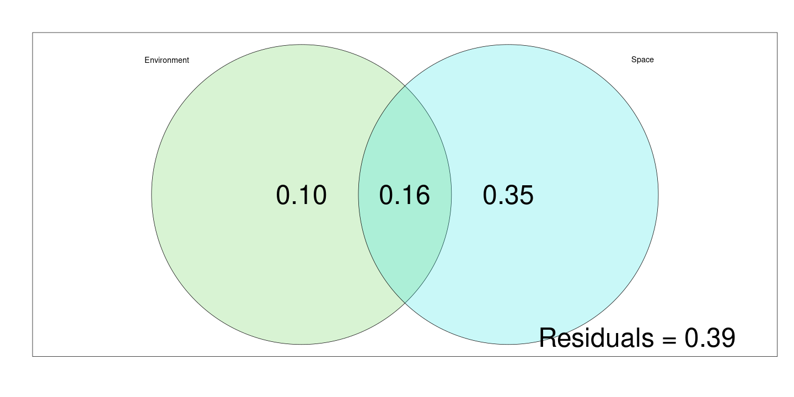

Rest
========================================================
And other stuff . . .
